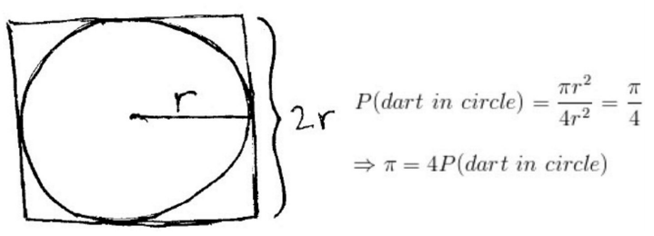
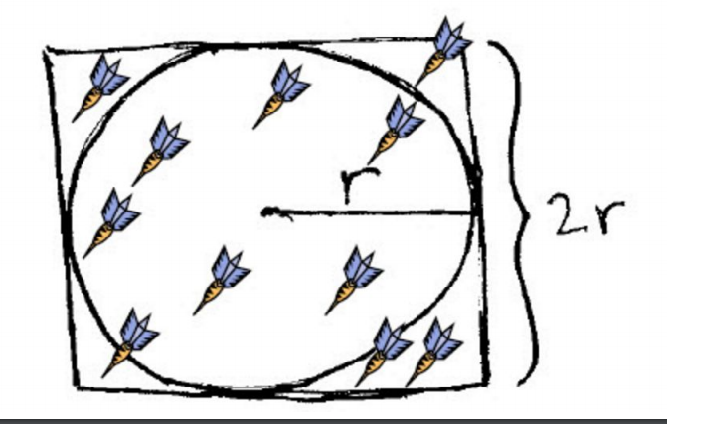

#Monte Carlo Pi Computation implementation using MapReduce 

##Estimating pi by random sampling

Imagine if you have dart board as shown in image then 
pi is the (ratio of darts that land inside the circle(S) to the total number of darts thrown(N)) times 4 
radius = sqrt((r-x)^2+(r-y)^2)

###4 * S/N = 4* (pi * r * r)/(2 r)^2 = 4 * pi * r * r / 4 * r * r = pi

##Prerequisites

Download the below mentioned jars and configure into project build path 

hadoop-common-2.7.0.jar

hadoop-core-0.20.2.jar

org.apache.commons.cli-1.2.0.jar

JRE System Library[JavaSE-1.7] or above

##Project creation and execution steps

###Part 1:
Generated 2,000,000 Random number of double type along with user input for radius and stored
in a file as PiCalculationInput.txt using RandomSetGenerate.java.

###Part2: 
Write MapReduce program to calculate Pi value.
Create PiValue.jar file using PiValue.java.

###Part3:
####Setting up an EC2 key pair
login AWS account, Go to Services and select EC2
In EC2, Click on Key Pairs , create a Key Pair and store it in your local machine.

####Creating S3 Bucket
Go to Services and select S3.
In S3, Create bucket by providing bucket name and region where you want to create your bucket.
Click on created bucket and  create seven folders named as Data, Logs, Results and Jobs.
Now  upload appropriate files into the folders

a. Upload the PiValue.jar file into Jobs folder

b. Upload the PiCalculationInput.txt file into Data folder 

####Creating Cluster 
Go to Services and Click on Elastic MapReduce in the AWS console management.
Click on create cluster.
Provide the cluster details

a. Give the Cluster name and select the log folder

b. Select the key pair which we have created

c. After completing all the details click on Create cluster

d. The cluster will start within 10-15 minutes

e. In Steps, select the Custom JAR and click on Configure and provide the JAR location along with arguments details and save it

f. After completion go to the S3bucket and in Results folder we can see the output file.

##Result
Right click on the output file and click on download and open the file with notepad.We can see our expected output.

 

